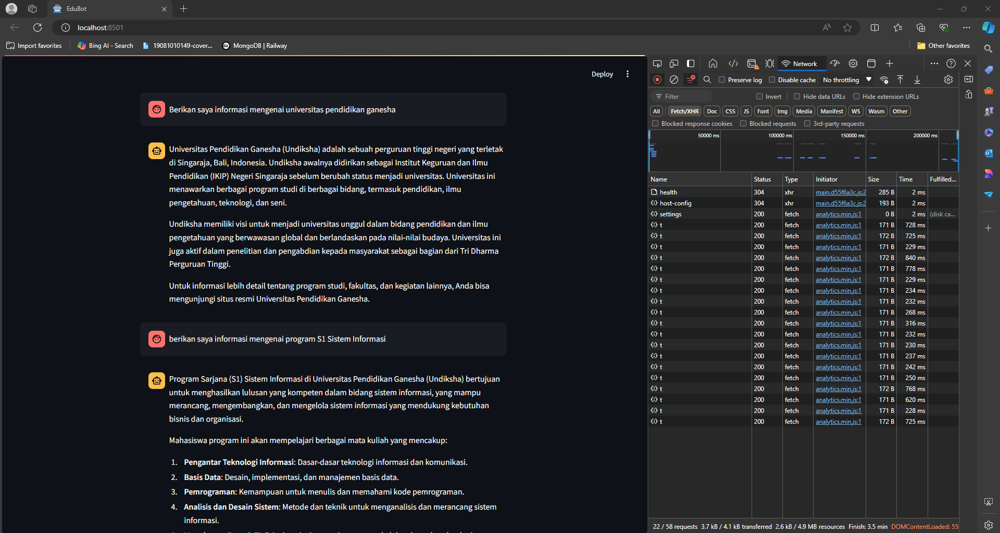

# RAG Chatbot

## Overview

This project is an LLM Chatbot powered by Retrieval-Augmented Generation (RAG). The tech stack includes Python, Langchain, OpenAI, and Chroma vector store. The chatbot is designed to provide accurate and contextually relevant responses by leveraging external knowledge sources.

## Table of Contents

1. [Installation](#installation)
2. [Running the Application](#running-the-application)
3. [Technology Stack](#technology-stack)
4. [Logic and Implementation](#logic-and-implementation)
5. [Documentation](#documentation)

## Installation

1. **Clone the repository and navigate to the project directory:**
   ```bash
   git clone <repository-url>
   cd path/to/repo
   ```

2. **Create and activate a virtual environment:**
   ```bash
   python -m venv myvenv
   myvenv\Scripts\activate  # On Windows
   # source myvenv/bin/activate  # On macOS/Linux
   ```

3. **Install libraries and dependencies:**
   ```bash
   pip install -r requirements.txt
   ```

4. **Get [OpenAI API key](https://platform.openai.com/account/api-keys)**

## Running the Application

1. **Split documents and save to Supabase Vector database (Run once or only when you need to store a document):**
   ```bash
   cd src
   python split_document.py
   ```

   If the operation is successful, you should see a `Success!` message.

2. **Run the Streamlit app:**
   ```bash
   streamlit run main.py
   ```

   After running this command, you can view your Streamlit app in your browser at:
   - Local URL: `http://localhost:8501`
   - Network URL: `http://192.168.18.16:8501` (or your local network IP)

## Technology Stack

- **Langchain**: A framework for building applications with large language models. It provides tools for managing prompts, chains, and memory.
- **Chroma**: A vector store used to store and retrieve document embeddings efficiently.
- **Streamlit**: A web application framework for creating interactive applications with Python.
- **OpenAI**: Provides the language model API used for generating responses.

## Logic and Implementation

### Retrieval-Augmented Generation (RAG)

RAG is a technique that enhances the performance of LLMs by retrieving relevant documents from a knowledge base and using them as context for generating responses. This approach reduces the need for fine-tuning and allows for more agile updates to the knowledge base.

### Langchain

Langchain is used to manage the conversational flow and retrieval logic. It integrates with OpenAI's API to generate responses based on the retrieved context.

### Chroma

Chroma is used to store document embeddings. It allows for efficient retrieval of relevant documents based on user queries.

### Streamlit

Streamlit is used to create the user interface for the chatbot. It provides an interactive platform for users to input queries and receive responses.

### OpenAI

OpenAI's API is used to generate responses. The model is configured to use the `gpt-3.5-turbo` variant, which provides high-quality conversational capabilities.

## Documentation

For more detailed documentation, refer to the following resources:

- [Streamlit Docs](https://docs.streamlit.io/get-started)
- [Langchain Python Docs](https://python.langchain.com/v0.2/docs/introduction/)
- [Langchain Conversational RAG Docs](https://python.langchain.com/v0.2/docs/tutorials/qa_chat_history/)

